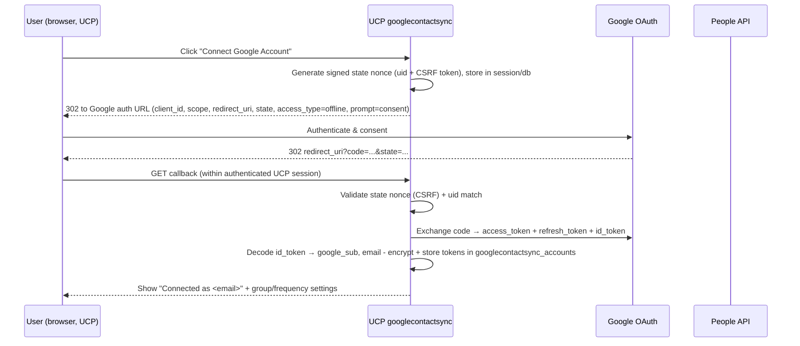

# Google Contact Sync — FreePBX Module Implementation Specification

> **Audience:** Claude Opus 4.8 + GitHub Copilot building this module.
> **Status:** Authoritative build spec. Implement to this document. When a detail is
> not specified, follow the conventions of the existing `contactmanager` module
> (located at `/var/www/html/admin/modules/contactmanager`) and FreePBX 17 BMO patterns.

---

## 1. Goal & Scope

Build a new FreePBX module, **`googlecontactsync`**, that imports a user's Google
Contacts (via the **Google People API**) into the FreePBX **Contact Manager**
(`contactmanager`) module.

Core requirements (confirmed with the product owner):

1. **End users self-authorize** their own Google account from **UCP** (User Control
   Panel) using OAuth 2.0 — no admin involvement per user.
2. Each user **selects the Contact Manager group** the contacts import into: either
   one of their own **private** groups (create a new one if none exists) or an
   **external** group they have access to.
3. Contacts are synced **automatically on a schedule** (default hourly/daily/weekly,
   set by admin; **overridable per user** in UCP).
4. Sync is **one-way** (Google → FreePBX), **incremental** using the People API
   `syncToken`, and mirrors **updates and deletions**.
5. The **admin module page** lets the administrator enter Google OAuth credentials,
   set the global default frequency, and view per-user connection status, last sync
   time, and sync logs/errors.

### 1.1 Out of scope (do not build)
- Writing/pushing contacts back to Google (no two-way sync).
- Importing Google "Other contacts" or directory contacts (only `connections`,
  i.e. the user's own contacts). May be a future enhancement.
- CardDAV. We use the People API only.

---

## 2. Decisions Reference (locked)

| Topic | Decision |
|---|---|
| Who authorizes | UCP end users (one Google account per user) |
| OAuth app credentials | Admin supplies their **own** Google Cloud OAuth Client ID/Secret in the admin page |
| Server reachability | Public **HTTPS FQDN** available → standard web redirect (authorization code) flow |
| Import target | User-selected **private** group (auto-create if none) **or** an assigned **external** group |
| Sync strategy | **Incremental** via People API `syncToken`; mirror updates **and** deletions |
| External group deletes | **Full mirror** — the user's sync manages the contacts it owns in that group (deletion scoped to this account's mapping table; see §8.4) |
| Accounts per user | **One** Google account per user |
| Fields imported | Names (display/first/last), **title**, phone numbers (+type), emails, company/job title, addresses, websites, photo/avatar |
| Frequency | Presets **hourly / daily / weekly** (with time-of-day for daily/weekly); admin default + per-user override |
| Target platform | **FreePBX 17 / PHP 8.2** |
| Author / Publisher | **Dr. Patrick Maier** — Softwareentwicklung Patrick Maier, <https://www.se-pm.de>, <mail@se-pm.de> |
| License | **GPLv3+** with the author's copyright header in every file (FreePBX integrates GPLv3 BMO code, so the distributed work must be GPL‑compatible). MIT/Apache‑2.0 are acceptable alternatives that also preserve the author's attribution if the module is ever distributed standalone. |

Every PHP file must begin with this copyright header:

```php
<?php
// Google Contact Sync — FreePBX module
// Copyright (C) 2026 Dr. Patrick Maier, Softwareentwicklung Patrick Maier
// https://www.se-pm.de — mail@se-pm.de
//
// This program is free software: you can redistribute it and/or modify it under
// the terms of the GNU General Public License as published by the Free Software
// Foundation, either version 3 of the License, or (at your option) any later version.
```

---

## 3. Background: How Contact Manager Stores Data

Read these before coding. Key facts derived from
`/var/www/html/admin/modules/contactmanager/Contactmanager.class.php` and its
`module.xml`:

- Main class: `FreePBX\modules\Contactmanager extends FreePBX_Helpers implements BMO`.
- DB access via PDO: `$this->db = $freepbx->Database;` (prepared statements).
- **Groups** (`contactmanager_groups`): `id, owner, name, type`. `type` is one of
  `internal` (auto from extensions — **not** a valid import target), `external`
  (shared, `owner = -1`), `private` (owned by a userman uid).
- **Entries** (`contactmanager_group_entries`): `id, groupid, user, displayname,
  fname, lname, title, company, address, uuid`.
- Child tables keyed by `entryid`:
  - `contactmanager_entry_numbers` (`number, type, extension, countrycode,
    nationalnumber, regioncode, locale, stripped, type, flags, E164, possibleshort`)
  - `contactmanager_entry_emails` (`email`)
  - `contactmanager_entry_websites` (`website`)
  - `contactmanager_entry_xmpps` (`xmpp`)
  - `contactmanager_entry_images` (`image` BLOB, `format`, `gravatar`)
  - `contactmanager_entry_speeddials`

### 3.1 Public API of Contact Manager to call (do NOT write SQL into CM tables directly)

Use the `contactmanager` BMO object obtained via
`$this->FreePBX->Contactmanager` (or `\FreePBX::create()->Contactmanager`).

| Method | Purpose |
|---|---|
| `getGroups($bypassCache=false)` | All groups |
| `getGroupsbyOwner($owner)` | Groups owned by a userman uid (private) |
| `getGroupByID($id)` | Single group |
| `addGroup($name, $type='internal', $owner=-1, $updateContactFile=true)` | Create group; returns `['status','id',...]` |
| `addEntryByGroupID($groupid, $entry, $updateContactFile=true, $timeDelay=0)` | Add a contact; returns `['status','id',...]` |
| `updateEntry($id, $entry, $updateContactFile=true)` | Update a contact |
| `deleteEntryByID($entryid)` | Delete a contact |
| `getEntriesByGroupID($groupid)` | Entries in a group |

**`$entry` array shape** accepted by `addEntryByGroupID` / `updateEntry`:

```php
$entry = [
    'userid'      => -1,                 // keep -1 for imported external contacts
    'displayname' => 'Jane Doe',
    'fname'       => 'Jane',
    'lname'       => 'Doe',
    'title'       => 'CTO',              // job title
    'company'     => 'Acme Inc',
    'address'     => '123 Main St, ...', // single formatted string
    'numbers'     => [
        ['number' => '+15551234567', 'type' => 'cell', 'extension' => '',
         'flags' => [], 'speeddial' => '', 'locale' => ''],
    ],
    'emails'      => [['email' => 'jane@acme.com']],
    'websites'    => [['website' => 'https://acme.com']],
    'image'       => '<base64-or-binary>', // optional photo
    'gravatar'    => false,
];
```

> The module **must not** INSERT/UPDATE Contact Manager tables directly. Always go
> through the public methods so caches, contact-file regeneration, and hooks fire
> correctly.

---

## 4. Module File Layout

Create the module at `/var/www/html/admin/modules/googlecontactsync/`:

```
googlecontactsync/
├── module.xml                       # module manifest (schema, deps, hooks, console, cron)
├── install.php                      # optional bootstrap (prefer BMO install())
├── Googlecontactsync.class.php      # main BMO admin class
├── functions.inc.php                # hooks / dialplan (likely minimal/none)
├── page.googlecontactsync.php       # admin page controller (showPage pattern)
├── composer.json                    # requires google/apiclient
├── composer.lock
├── LICENSE                          # GPLv3+
├── README.md
├── module.sig                       # generated by FreePBX signing (do not hand-write)
├── Console/
│   └── Googlecontactsync.php        # fwconsole command: scheduled + manual sync
├── Lib/
│   ├── GoogleClientFactory.php      # builds Google\Client from stored creds
│   ├── PeopleSync.php               # core sync engine (People API → Contact Manager)
│   ├── ContactMapper.php            # maps a Google Person → CM $entry array
│   └── TokenStore.php               # encrypted token persistence helper
├── ucp/
│   ├── Googlecontactsync.class.php  # UCP module (connect/disconnect, settings)
│   └── assets/
│       ├── js/global.js
│       └── css/global.css
├── assets/
│   ├── js/googlecontactsync.js      # admin JS
│   └── css/googlecontactsync.css
├── views/
│   ├── main.php                     # admin page (tabs: Settings, Users, Logs)
│   ├── settings.php
│   ├── users.php
│   └── logs.php
├── i18n/                            # gettext .pot/.po
└── utests/                          # PHPUnit tests
```

---

## 5. `module.xml`

Model after `contactmanager/module.xml`. Required elements:

```xml
<module>
    <rawname>googlecontactsync</rawname>
    <repo>standard</repo>
    <name>Google Contact Sync</name>
    <version>1.0.0</version>
    <publisher>Dr. Patrick Maier (Softwareentwicklung Patrick Maier)</publisher>
    <license>GPLv3+</license>
    <licenselink>http://www.gnu.org/licenses/gpl-3.0.txt</licenselink>
    <category>Admin</category>
    <description>Imports each user's Google Contacts into Contact Manager via the Google People API, on a configurable schedule, with per-user OAuth from UCP.</description>
    <menuitems>
        <googlecontactsync needsenginedb="yes">Google Contact Sync</googlecontactsync>
    </menuitems>
    <depends>
        <version>17.0.1</version>
        <module>contactmanager ge 17.0.1</module>
        <module>userman ge 17.0.1</module>
    </depends>
    <supported>
        <version>17.0</version>
    </supported>

    <!-- UCP integration: register the user-facing config page -->
    <hooks>
        <ucp class="Ucp">
            <method callingMethod="constructModuleConfigPages" class="Googlecontactsync" namespace="FreePBX\modules">ucpConfigPage</method>
            <method callingMethod="delUser" class="Googlecontactsync" namespace="FreePBX\modules">ucpDelUser</method>
        </ucp>
        <userman class="Userman" namespace="FreePBX\modules">
            <method callingMethod="delUser" class="Googlecontactsync" namespace="FreePBX\modules">usermanDelUser</method>
        </userman>
    </hooks>

    <database>
        <table name="googlecontactsync_accounts">
            <field name="id" type="integer" primaryKey="true" autoincrement="true"/>
            <field name="uid" type="integer"/>                 <!-- userman user id -->
            <field name="google_sub" type="string" length="64" notnull="false"/> <!-- stable Google account id -->
            <field name="google_email" type="string" length="255" notnull="false"/>
            <field name="access_token" type="text" notnull="false"/>   <!-- encrypted JSON -->
            <field name="refresh_token" type="text" notnull="false"/>  <!-- encrypted -->
            <field name="token_expires" type="integer" notnull="false"/>
            <field name="sync_token" type="text" notnull="false"/>     <!-- People API syncToken -->
            <field name="target_groupid" type="integer" notnull="false"/>
            <field name="target_group_type" type="string" length="25" notnull="false"/>
            <field name="frequency" type="string" length="20" notnull="false"/> <!-- override or 'default' -->
            <field name="freq_time" type="string" length="5" notnull="false"/>   <!-- HH:MM for daily/weekly -->
            <field name="freq_dow" type="integer" notnull="false"/>              <!-- 0-6 for weekly -->
            <field name="enabled" type="boolean" default="1"/>
            <field name="last_sync" type="integer" notnull="false"/>
            <field name="last_status" type="string" length="20" notnull="false"/> <!-- ok|error|running -->
            <field name="last_message" type="text" notnull="false"/>
            <field name="created" type="integer" notnull="false"/>
            <field name="updated" type="integer" notnull="false"/>
            <key name="uid_unique" type="unique"><column name="uid"/></key>
        </table>

        <table name="googlecontactsync_contacts">
            <field name="id" type="integer" primaryKey="true" autoincrement="true"/>
            <field name="account_id" type="integer"/>
            <field name="resource_name" type="string" length="128"/>  <!-- people/cXXXX -->
            <field name="etag" type="string" length="128" notnull="false"/>
            <field name="entryid" type="integer"/>                    <!-- contactmanager_group_entries.id -->
            <field name="groupid" type="integer"/>
            <field name="last_synced" type="integer" notnull="false"/>
            <key name="acct_resource" type="unique">
                <column name="account_id"/>
                <column name="resource_name"/>
            </key>
        </table>

        <table name="googlecontactsync_logs">
            <field name="id" type="integer" primaryKey="true" autoincrement="true"/>
            <field name="account_id" type="integer" notnull="false"/>
            <field name="uid" type="integer" notnull="false"/>
            <field name="started" type="integer"/>
            <field name="finished" type="integer" notnull="false"/>
            <field name="status" type="string" length="20"/>          <!-- ok|error -->
            <field name="added" type="integer" default="0"/>
            <field name="updated" type="integer" default="0"/>
            <field name="deleted" type="integer" default="0"/>
            <field name="message" type="text" notnull="false"/>
        </table>
    </database>

    <console>
        <command>
            <name>googlecontactsync</name>
        </command>
    </console>
</module>
```

> Global settings (Client ID, Client Secret, global default frequency) are stored via
> the BMO `FreePBX_Helpers` KV store (`$this->setConfig()/$this->getConfig()`), not a
> table. The **Client Secret must be stored encrypted** (see §9).

---

## 6. `composer.json`

```json
{
    "require": {
        "google/apiclient": "^2.15"
    },
    "config": {
        "optimize-autoloader": true,
        "platform": { "php": "8.2" }
    }
}
```

Run `composer install` in the module dir and commit `vendor/`. Use the
`Google\Client` and `Google\Service\PeopleService` classes. Recommended: strip
unused Google services with `google/apiclient-services` `Google_Task_Composer`
(keep only `PeopleService`) to reduce footprint.

---

## 7. OAuth 2.0 Flow (Authorization Code, per UCP user)

### 7.1 Admin prerequisite (documented in README + admin page help text)
The administrator creates a Google Cloud project:
1. Enable the **People API**.
2. Configure the **OAuth consent screen** (External; add the required scope
   `.../auth/contacts.readonly`; add test users or publish).
3. Create **OAuth client credentials → Web application**.
4. Add the **Authorized redirect URI** shown on the FreePBX admin page, e.g.
   `https://<FQDN>/ucp/index.php` (the exact value is displayed for copy/paste).
5. Paste **Client ID** and **Client Secret** into the Google Contact Sync admin page.

### 7.2 Scope
- `https://www.googleapis.com/auth/contacts.readonly` (read-only — least privilege).
- Request `access_type=offline` and `prompt=consent` to obtain a **refresh token**.

### 7.3 Flow



### 7.4 Callback handling
- Redirect URI is a **fixed** UCP URL (`https://<FQDN>/ucp/index.php`). The UCP
  `googlecontactsync` module detects the callback by a recognizable query parameter
  (e.g. `?googlecontactsync=oauth&code=...&state=...`) and routes it to its handler
  **before** rendering normal UCP content.
- The browser already carries the **UCP session cookie**, so the user is
  authenticated; bind the `state` nonce to the logged-in uid and reject mismatches.
- **CSRF:** `state` = HMAC-signed value containing a per-session random nonce + uid +
  expiry. Validate signature and single-use before exchanging the code.
- After exchange, **discard the authorization code** and never log tokens.

---

## 8. Sync Engine (`Lib/PeopleSync.php`)

### 8.1 People API request
- Initial connect / first sync: `people.connections.list`
  - `resourceName=people/me`
  - `personFields=names,emailAddresses,phoneNumbers,organizations,addresses,urls,photos,metadata`
  - `requestSyncToken=true`
  - `pageSize=200` (paginate with `pageToken`)
- Subsequent syncs: same call with `syncToken=<stored>` and `requestSyncToken=true`.
  - On HTTP 400 `EXPIRED_SYNC_TOKEN`: clear stored token and perform a **full
    resync** (and reconcile deletions, see §8.4).
- Persist the **new** `nextSyncToken` from the last page after a successful run.

### 8.2 Token refresh
- Before each run, load the `Google\Client`, set the stored access token JSON.
- If `$client->isAccessTokenExpired()`, call
  `$client->fetchAccessTokenWithRefreshToken($refreshToken)`, persist the new
  access token (and refresh token if Google returns a new one).
- If refresh fails (revoked/`invalid_grant`): mark account `last_status='error'`,
  set a clear message ("Google access revoked — please reconnect"), disable
  scheduled runs until the user reconnects, and surface in admin + UCP.

### 8.3 Mapping Google Person → Contact Manager entry (`Lib/ContactMapper.php`)

| Google People field | Contact Manager `$entry` |
|---|---|
| `names[0].displayName` | `displayname` — **prefix with `names[0].honorificPrefix`** if present (e.g. "Dr. Jane Doe"); fallback: `honorificPrefix + givenName + ' ' + familyName`, else email/phone |
| `names[0].givenName` | `fname` |
| `names[0].familyName` | `lname` |
| `names[0].honorificPrefix` (+ `honorificSuffix`) | `title` (e.g. "Dr.", "Prof.", "Jr.") |
| `organizations[0].name` | `company` — append `organizations[0].title` (job title) if present, e.g. "Acme Inc — CTO" |
| `addresses[0].formattedValue` | `address` (single string) |
| `phoneNumbers[]` | `numbers[]` (`number` = `value`; `type` mapped, see below) |
| `emailAddresses[].value` | `emails[]` |
| `urls[].value` | `websites[]` |
| `photos[0].url` (not default) | `image` (download, base64; set `format`) |

**Phone type mapping** Google `type` → Contact Manager `type`:
`mobile|cell → cell`, `work → work`, `home → home`, `workMobile → work`,
`main → other`, `fax|homeFax|workFax → fax`, default → `other`. Keep the raw
international `value`; let Contact Manager normalize (it uses libphonenumber).

> **Note on `main`:** Google's `main` type denotes a person's primary/central line
> and maps cleanly to neither `work` nor `home`; map it to `other` to avoid
> mislabeling. (Contact Manager accepts `cell`, `work`, `home`, `fax`, `other`,
> `internal` — there is no `main` type.)

> **Note on honorific:** the People API exposes `names[].honorificPrefix`
> ("Dr.", "Prof.") and `honorificSuffix` ("Jr.", "PhD"). These map to Contact
> Manager's `title` field (combine prefix + suffix, trimmed) **and** the
> `honorificPrefix` is also prepended to `displayname` (e.g. "Dr. Jane Doe"). Because
> `title` is the honorific, the **job title** from `organizations[0].title` is
> appended to `company` (e.g. "Acme Inc — CTO") so it is not lost; if there is no
> company, use the job title alone as `company`.

**Skip rules:** ignore a Person with no usable name, phone, **and** email.

### 8.4 Reconciliation algorithm (per account)

```
1. Refresh token; build People client.
2. Resolve target group:
     - If account.target_groupid still exists and user still owns/has access → use it.
     - Else if private mode and no group → addGroup("Google Contacts", 'private', uid).
3. Fetch connections (incremental if sync_token present, else full).
4. For each returned Person:
     a. resourceName = person.resourceName; etag = person.etag.
     b. If metadata.deleted == true (incremental):
          - look up googlecontactsync_contacts by (account_id, resourceName);
            if found → contactmanager.deleteEntryByID(entryid); delete mapping row; deleted++.
        Else:
          - $entry = ContactMapper.map(person)
          - look up mapping:
              * found:
                  - if etag unchanged → skip (no-op);
                  - else contactmanager.updateEntry(entryid, $entry); update etag; updated++.
              * not found:
                  - res = contactmanager.addEntryByGroupID(target_groupid, $entry)
                  - insert mapping (account_id, resourceName, etag, res.id, target_groupid); added++.
5. FULL-SYNC deletion reconciliation (only when no valid sync_token was used):
     - Build set S of resourceNames returned this run.
     - For each mapping row of this account whose resourceName ∉ S:
         contactmanager.deleteEntryByID(entryid); remove mapping; deleted++.
   (Incremental runs rely on step 4b for deletions.)
6. Persist nextSyncToken, last_sync=now, last_status='ok', counts → googlecontactsync_logs.
7. On any exception: last_status='error', record message + log row; do NOT persist a
   partial sync_token (so the next run can recover).
```

> **External "full mirror" note:** deletions in step 4b/5 are scoped to rows this
> account created in `googlecontactsync_contacts`. The module never deletes entries
> it did not import, so a shared external group can also contain manually added
> contacts safely. This satisfies "the user's sync manages the contacts it owns"
> while protecting other users' data.

### 8.5 Idempotency & batching
- Wrap each account's run so one failing account does not block others.
- Use `etag` to avoid needless `updateEntry` calls.
- Pass `$updateContactFile=false` on per-entry CM calls during a batch, then call
  Contact Manager's contact-file regeneration **once** at the end (see
  `updateContactUpdatedDetails`) to avoid regenerating files per contact.

---

## 9. Security Requirements (must implement)

- **Token storage encryption:** Encrypt `access_token`, `refresh_token`, and the
  admin **Client Secret** at rest. Use `sodium_crypto_secretbox` with a 256-bit key.
  Key source priority: (a) a key file under `/etc/freepbx`/module data dir with
  `0600` perms created on install; (b) derive from an existing FreePBX secret if a
  suitable one is available. Implement in `Lib/TokenStore.php`. Never store the raw
  Client Secret or tokens in plaintext, logs, or the KV store.
- **OAuth CSRF:** signed, single-use `state` parameter bound to the UCP session uid.
- **Least privilege scope:** `contacts.readonly` only.
- **No secret leakage:** never write tokens/secrets to `freepbx.log`, sync logs, or
  exceptions surfaced to the UI. Redact.
- **Transport:** require HTTPS for the redirect URI; refuse to start OAuth if the
  configured FQDN is not HTTPS.
- **Input validation / OWASP:** all DB access via PDO prepared statements; escape all
  output in views (use FreePBX `htmlspecialchars`/Bootstrap helpers); validate
  group ownership server-side before importing into a selected group; verify the
  `id_token` signature/audience (`aud == client_id`) when reading `google_sub`.
- **Authorization:** a UCP user may only connect/disconnect and configure **their
  own** account; the admin page is gated by standard FreePBX admin auth.
- **Account deletion:** on `usermanDelUser`/`ucpDelUser`, delete the account row,
  its mappings, optionally remove imported entries, and **revoke** the Google token
  (`https://oauth2.googleapis.com/revoke`).

---

## 10. Scheduling

### 10.1 Mechanism
- In BMO `install()`, register **one** recurring system cron entry via the FreePBX
  Cron BMO (`$this->FreePBX->Cron(...)`) that runs every **15 minutes**:
  `fwconsole googlecontactsync --runsync`
- The console command iterates all `enabled` accounts and runs only those **due**,
  based on the effective frequency (per-user override else admin default) and
  `last_sync`:
  - `hourly`: due if `now - last_sync >= 3600`.
  - `daily`: due if it's a new day past `freq_time` and not yet synced today.
  - `weekly`: due if `dow == freq_dow` and past `freq_time` and not synced this week.
- Remove the cron entry in `uninstall()`.

### 10.2 Console command (`Console/Googlecontactsync.php`)
Symfony Console command (FreePBX pattern). Options:
- `--runsync` — run all due accounts (used by cron).
- `--uid=<id>` — force-sync one user now (used by "Sync now" buttons).
- `--all` — force-sync every enabled account regardless of schedule.
- `--list` — print account status table.
Exit non‑zero on fatal errors; print per-account summary (added/updated/deleted).

---

## 11. Admin Page (`page.googlecontactsync.php` + `views/`)

BMO `showPage`/`getActionBar` pattern (see `contactmanager`). Tabs:

1. **Settings**
   - Google **Client ID** (text), **Client Secret** (password; write-only, shows
     "•••• set" when present).
   - Read-only **Redirect URI** to copy into Google Cloud Console.
   - **Global default frequency** (hourly/daily/weekly + time-of-day + day-of-week).
   - "Test credentials" button (validates format / token endpoint reachability).
2. **Users** — table of `googlecontactsync_accounts`: user, Google email, target
   group, effective frequency, last sync, status. Actions: **Sync now**,
   **Disconnect** (revoke + clear).
3. **Logs** — paginated `googlecontactsync_logs` with status, counts, message;
   filter by user/status; "Clear old logs".

All form posts go through the BMO `ajaxRequest`/`ajaxHandler` or `doConfigPageInit`
POST handling; validate and CSRF-protect using FreePBX's built-in token.

---

## 12. UCP Module (`ucp/Googlecontactsync.class.php`)

Implements the UCP module contract (see `contactmanager/ucp/`). Provides a widget/
config page where the user can:

- **Connect Google Account** (starts OAuth, §7) / **Disconnect** (revoke + clear).
- See connection status: connected email, last sync time, last result.
- **Select target group**: dropdown of the user's **private** groups + an option
  **"Create new private group 'Google Contacts'"**, plus any **external** groups the
  user is permitted to use. Persist to `target_groupid`/`target_group_type`.
- **Frequency override**: "Use system default (<value>)" or choose
  hourly/daily/weekly (+ time / day). Persist to `frequency`/`freq_time`/`freq_dow`.
- **Sync now** button → calls backend which runs `--uid=<self>`.

Server-side: every UCP action must re-derive the uid from the UCP session and ignore
any client-supplied uid (no IDOR). Validate that a selected group is owned by the
user (private) or in their allowed external groups before saving.

UCP hook registration is via the `<ucp>` hook in `module.xml`
(`ucpConfigPage` → `constructModuleConfigPages`).

---

## 13. Main BMO Class (`Googlecontactsync.class.php`)

```php
namespace FreePBX\modules;
class Googlecontactsync extends \FreePBX_Helpers implements \BMO {
    public function __construct($freepbx = null) { /* $this->db, $this->freepbx */ }
    public function install() {}        // create cron entry, default settings
    public function uninstall() {}      // remove cron entry
    public function doConfigPageInit($page) {}
    public function getActionBar($request) {}
    public function ajaxRequest($req, &$setting) {}   // allow needed commands
    public function ajaxHandler() {}                  // admin AJAX

    // Settings
    public function getClientId();
    public function setCredentials($clientId, $clientSecret); // encrypts secret
    public function getRedirectUri();                 // https://<FQDN>/ucp/index.php
    public function getGlobalFrequency();  public function setGlobalFrequency($f);

    // Accounts
    public function getAccountByUid($uid);
    public function getAllAccounts();
    public function saveAccountTokens($uid, $tokenArray, $idTokenClaims);
    public function setAccountTarget($uid, $groupid, $type);
    public function setAccountFrequency($uid, $freq, $time=null, $dow=null);
    public function disconnect($uid);   // revoke + purge

    // OAuth
    public function buildAuthUrl($uid);          // returns Google consent URL + state
    public function handleOAuthCallback($code, $state); // exchange + store

    // Sync (delegates to Lib\PeopleSync)
    public function syncUid($uid);
    public function runDueSyncs();

    // Hooks
    public function ucpConfigPage($mods, $uid);
    public function ucpDelUser($id, $display, $data);
    public function usermanDelUser($id, $display, $data);
}
```

---

## 14. Build Plan / Milestones (for Claude + Copilot)

Implement in order; each milestone should be independently testable.

- [ ] **M0 — Scaffold:** `module.xml`, `Googlecontactsync.class.php` skeleton,
      `composer.json`, `install.php`, LICENSE, README. `fwconsole ma install
      googlecontactsync` succeeds and creates tables.
- [ ] **M1 — Admin settings:** Settings tab; store Client ID + encrypted Secret;
      display redirect URI; global frequency. `TokenStore` encryption + unit tests.
- [ ] **M2 — OAuth:** `buildAuthUrl`, UCP "Connect" button, callback handler, token
      exchange, encrypted persistence, `google_sub`/email via verified `id_token`.
- [ ] **M3 — Mapper + first sync:** `ContactMapper`, `PeopleSync` full sync into a
      user-selected/auto-created private group; mapping table populated.
- [ ] **M4 — Incremental + deletions:** `syncToken` persistence, deleted handling,
      `EXPIRED_SYNC_TOKEN` recovery, full-sync deletion reconciliation.
- [ ] **M5 — Scheduling:** console command `--runsync/--uid/--all/--list`; cron
      registration in `install()`; per-user override + admin default due-logic.
- [ ] **M6 — UCP UX:** group selector, frequency override, status, Sync now,
      Disconnect (revoke).
- [ ] **M7 — Admin Users + Logs tabs:** status table, Sync now, Disconnect, logs.
- [ ] **M8 — Lifecycle:** `usermanDelUser`/`ucpDelUser` cleanup + token revoke;
      `uninstall()` removes cron + (optionally) imported data.
- [ ] **M9 — Hardening + tests:** security review (§9), i18n strings, PHPUnit, signing.

---

## 15. Testing

- **Unit (PHPUnit, `utests/`):**
  - `ContactMapper`: Google Person fixtures → expected `$entry` (names, phone-type
    mapping, missing fields, photo handling, skip rules).
  - `TokenStore`: encrypt/decrypt round-trip; tamper detection.
  - Due-time logic for hourly/daily/weekly.
- **Integration (mock People API):** inject a fake `Google\Service\PeopleService` or
  HTTP handler returning canned `connections.list` pages, including a `syncToken`,
  an updated etag, and a `metadata.deleted` record; assert add/update/delete counts
  and Contact Manager calls.
- **Manual E2E:** real Google test account → connect via UCP → verify import →
  edit/delete in Google → re-sync → verify mirror; revoke access → verify graceful
  error + reconnect.
- **Security checks:** confirm no tokens in logs; state nonce reuse rejected; IDOR
  attempts (other uid) rejected; importing into a non-owned group rejected.

---

## 16. Google Cloud Setup (README content for admins)

1. Create/select a project at <https://console.cloud.google.com>.
2. **APIs & Services → Library →** enable **People API**.
3. **OAuth consent screen:** User type *External*; app name/support email; add scope
   `.../auth/contacts.readonly`; add test users (or publish the app).
4. **Credentials → Create credentials → OAuth client ID → Web application.**
5. **Authorized redirect URIs:** add the value shown on the module's Settings tab
   (e.g. `https://pbx.example.com/ucp/index.php`).
6. Copy **Client ID** + **Client Secret** into the module Settings tab.
7. Users go to **UCP → Google Contact Sync → Connect Google Account**.

---

## 17. Open Items / Future Enhancements (not required now)

- Import Google contact **groups/labels** as separate Contact Manager groups.
- Import **"Other contacts"** / domain directory (different scope + UI toggle).
- Optional **strict mirror** mode that also removes untracked entries in an external
  group (off by default).
- Multiple Google accounts per user.
- Webhook/push notifications instead of polling (People API has limited push).

---

## 18. Conventions & Gotchas

- Follow `contactmanager`'s coding style (tabs, `FreePBX\modules` namespace,
  `FreePBX_Helpers` + `BMO`). Access other modules via `$this->FreePBX->Contactmanager`
  and `$this->FreePBX->Userman`.
- Never write directly to `contactmanager_*` tables — use the public methods (§3.1).
- Regenerate contact files **once per sync batch**, not per contact.
- All money/secret-bearing fields encrypted; all queries parameterized.
- `module.sig` is produced by FreePBX signing tooling — don't author it manually.
- Keep `vendor/` committed (FreePBX modules ship dependencies).

---

## 19. Author / Contact

- **Author:** Dr. Patrick Maier
- **Business:** Softwareentwicklung Patrick Maier (freelancer)
- **Website:** <https://www.se-pm.de>
- **Email:** <mail@se-pm.de>
- **Copyright:** © 2026 Dr. Patrick Maier — licensed under GPLv3+ (see §2 header).
```
